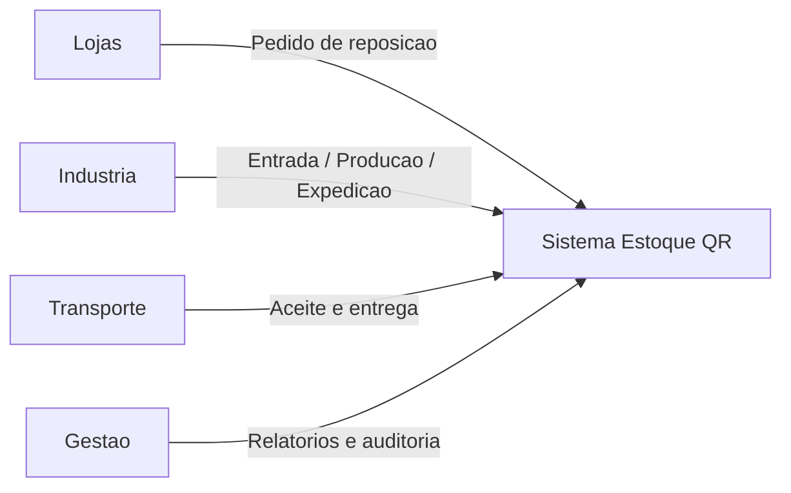
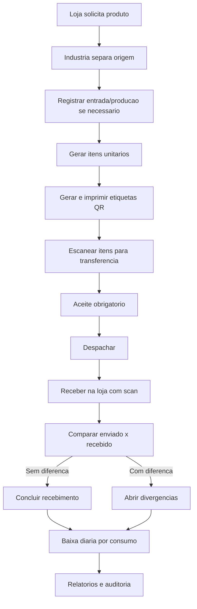
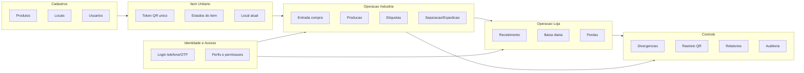
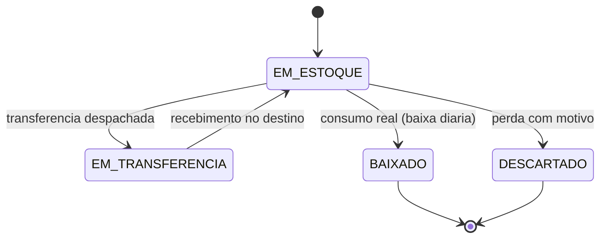
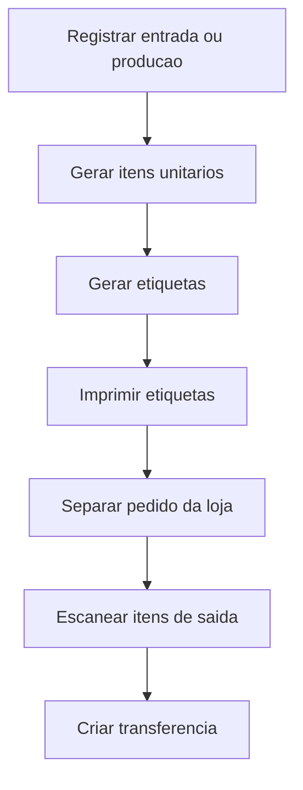

# Diagrama Raiz do Sistema (V1)

Este documento define a raiz logica do sistema do Acaí do Kim antes de qualquer evolucao de tela.

## 1) Objetivo central

Garantir controle real de estoque por unidade, com rastreabilidade por QR do inicio ao fim:

- entrada
- tokenizacao (QR unico por unidade)
- movimentacao
- recebimento
- consumo/perda
- auditoria

## 2) Fronteiras do sistema

## 3) Macrofluxo ponta a ponta

## 4) Dominios logicos (modulos)

## 5) Estado do item (regra mais critica)

## 6) Regras invariantes (nao podem quebrar)

1. Cada unidade fisica precisa ter QR unico.
2. Item so pode estar em um local por vez.
3. Sem aceite, nao existe despacho.
4. Recebimento sempre por conferência (scan).
5. Baixa/perda somente para item em estoque no local correto.
6. Toda acao critica precisa de auditoria.
7. Custo nao pode aparecer em etiqueta e em telas de loja.

## 7) Logica prioritaria da Industria (fase inicial)

### Resultado esperado dessa fase

- item nasce corretamente
- etiqueta nasce de item real
- estoque da industria fica confiavel
- transferencia sai com base rastreavel

## 8) Entidades nucleares

- `produtos`
- `locais`
- `usuarios`
- `lotes_compra`
- `itens`
- `transferencias`
- `transferencia_itens`
- `viagens`
- `divergencias`
- `baixas`
- `perdas`
- `auditoria`

## 9) Eventos obrigatorios de auditoria

- `ENTRADA_COMPRA`
- `PRODUCAO`
- `CRIAR_TRANSFERENCIA`
- `ACEITAR_TRANSFERENCIA`
- `DESPACHAR_TRANSFERENCIA`
- `RECEBER_TRANSFERENCIA`
- `BAIXA`
- `DESCARTE`
- `RESOLVER_DIVERGENCIA`

## 10) Ordem recomendada (sem telas novas ainda)

1. Validar e fechar esta logica (documento).
2. Fechar regras de dominio no backend/services.
3. Fechar controles de permissao por perfil/local.
4. So depois reorganizar home e fluxos de UI.

---

Se qualquer nova ideia nao fortalecer rastreabilidade, consistencia ou velocidade operacional, ela nao entra na fase atual.
